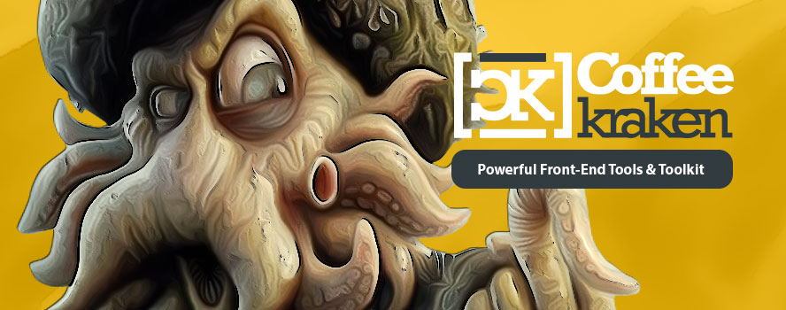

# Sugar 

<p>
	<!-- <a href="https://travis-ci.org/Coffeekraken/sugar">
		
	</a> -->
	<a href="https://www.npmjs.com/package/coffeekraken-sugar">
		
	</a>
	<a href="https://github.com/Coffeekraken/sugar/blob/master/LICENSE.txt">
		
	</a>
	<!-- <a href="https://github.com/coffeekraken/sugar">
		
	</a>
	<a href="https://github.com/coffeekraken/sugar">
		
	</a>
	<a href="https://github.com/coffeekraken/sugar">
		
	</a>-->
	<a href="https://twitter.com/coffeekrakenio">
		
	</a>
	<a href="http://coffeekraken.io">
		
	</a>
</p>

<p class="lead">Sugar gives you a lot of cool stuff to enhance your codebase.
It basically does nothing by default but let you grab what you want from it. It can be the colors management feature, as well as the spaces management, helper classes, etc...</p>

We like to think about this toolkit as

> A little (but powerful) sugar in your codebase

## Table of content

1. [Goals](#readme-goals)
2. [Install](#readme-install)
3. [Quick start](#readme-quick-start)
4. [Sass features](#readme-sass-features)
5. [JS features](#readme-js-features)
6. [What sugar does not](#readme-does-not)
7. [Other tools integration](#readme-tools-integration)
8. **[Some components demos](http://components.coffeekraken.io)**
9. [Contribute](#readme-contribute)
10. [Browsers support](#readme-browsers-support)
11. [License](#readme-license)
12. [Who are Coffeekraken](#readme-who-are-coffeekraken)

<a id="readme-goals"></a>
## Goals

The primary goal of this toolkit is to cover these needs:

1. Give you a way to **organize your codebase (colors, fonts, etc...)**
	- Sugar **does not tells you how your folders need to be layed out**
	- Help you to stay organized inside your code
		- [Colors](doc/sass/colors.md)
		- [Fonts](doc/sass/fonts.md)
		- [Etc...](doc/sass)
	- **Help a lot when you need to work in team**
2. Give you access to a large number of useful mixins like:
	- [s-font](doc/src/sass/core/mixins/_s-font.md) : Apply font property quickly
	- [s-clearfix](doc/src/sass/mixins/_s-clearfix.md) : Apply any clearfix (standard, overflow, float, etc...) type quickly
	- [s-placeholder](doc/src/sass/mixins/_s-placeholder.md) : Apply the input placeholder styling
	- [s-list-bullet](doc/src/sass/mixins/_s-list-bullet.md) : Create fully customized list bullets (icons, images, decimal, etc...)
	- [s-vertical-rhythme](doc/src/sass/core/mixins/_s-vertical-rhythme.md) : Set your vertical rhythme rules
	- [s-truncate-text](doc/src/sass/mixins/_s-truncate-text.md) : Truncate a text when to wide
	- [And many many more...](doc/src/sass)
3. Give you access to some cool effects that you can tweak like:
	- [s-depth](doc/src/sass/effects/_s-depth.md) : Material design depth shadows
	- [s-bubble](doc/src/sass/effects/_s-bubble.md) : Customizable speach bubbles
	- [s-side-lined](doc/src/sass/effects/_s-side-lined.md) : Simple side lines to apply on titles or whatever
	- [s-long-shadow](doc/src/sass/effects/_s-long-shadow.md) : Create a nice long shadow effect
	- Fully customizable one div loaders
	- [And many more...](doc/src/sass/effects)
4. Provide some useful daily use javascript functions like:
	- [closest](doc/src/js/dom/closest.md) : Equivalent of the jQuery **closest** functions
	- [whenInViewport](doc/src/js/dom/whenInViewport.md) : Let you know when an element enter the viewport the first time
	- [whenAttribute](doc/src/js/dom/whenAttribute.md) : Let you know when an element has a specifiy attribute (or that an attribute is a string, etc...)
	- [scrollTo](doc/src/js/dom/scrollTo.md) : Animate the scroll to a certain element in the page
	- [domReady](doc/src/js/dom/domReady.md) : Equivalent to the jQuery **ready** function
	- [getAnimationProperties](doc/src/js/dom/getAnimationProperties.md) : Return an object with the css animations properties
	- [And many, many, many more...](doc/src/js)
5. Provide some powerful javascript classes like:
	- [SWebComponent](doc/src/js/core/SWebComponentMixin.md) : Base class to create webcomponent based on **react** methods naming (componentWillMount, componentMount, etc...)
	- [SBinder](doc/src/js/classes/SBinder.md) : Allows you to bind object properties to another object
	- [SWatcher](doc/src/js/classes/SWatcher.md) : Allows you to monitor object properties
	- [STimer](doc/src/js/classes/SBinder.md) : Nice little class to handle timers (start, stop, pause, onTick, etc...)
	- [And many more...](doc/src/js/classes)
6. Plenty web components based on the ```SWebComponent``` class
	- These web components are separated into outside repositories
	- Official sugar web components are published on the [Coffeekraken github organisation](https://github.com/coffeekraken)
	- Well tested components
	- Open source so don't be afraid to [contribute](doc/contribute.md)!

<a id="readme-install"></a>
## Install

```npm install coffeekraken-sugar --save```

Release the kraken !!! 🦑

<a id="readme-quick-start"></a>
## Quick start

Here's how to get started quickly:

#### SASS (scss)

```scss
// import sugar
@import 'node_modules/coffeekraken-sugar/index';

// configure your sugar
@include s-setup((
	// configuration here...
));

// init (required to be just after s-setup calls)
@include s-init();

// generate the classes if you want
@include s-classes();
```

#### JS

In javascript, you just need to import what you want from the toolkit like so:

```js
import STimer from 'coffeekraken-sugar/js/classes/STimer';
// etc...
```

<a id="readme-sass-features"></a>
## Sass features

Here's a list of features that the toolkit will offer you. **Don't worry**, it seems like a lot, but you don't need to use all of them to start. Just pick what you need and let the rest aside...

- **[Colors](doc/sass/colors.md)** : Manage, organize and use colors easily
	- Named colors
	- Easy modifiers
	- Helper classes (optional)
	- [And more...](doc/sass/colors.md)
- **[Fonts](doc/sass/fonts.md)** : Keep your fonts really organized
	- Names fonts
	- Helper mixins
	- Helper classes (optional)
	- [And more...](doc/sass/fonts.md)
- **[Typography](doc/sass/typography.md)** : Full stack typography management
	- Helper mixins
	- Helper classes (optional) (lowercase, uppercase, aligns, etc...)
	- [And more...](doc/sass/typography.md)
- **[Sizes](doc/sass/sizes.md)** : Manage sizes ratios to keep consistent margins, etc...
	- Named sizes (smaller, small, default, etc...)
	- Fully customizable
	- Ratio based
	- [And more...](doc/sass/sizes.md)
- **[Spaces](doc/sass/spaces.md)** : Full stack spaces management
	- Named spaces (share sizes names)
	- Helper classes (optional)
		- ```.m-b-small``` : Margin bottom small
		- ```.m-t-big``` : Margin top big
		- ```.p-l``` : Padding left (default)
		- Etc...
	- Helper mixins
	- [And more...](doc/sass/spaces.md)
- **[Look and feel](doc/sass/look-and-feel.md)** : Handle how your components (atoms) looks across your site
	- **em** unit based
	- Helper mixins
	- Ensure a consistent feel across your website
	- [And more...](doc/sass/look-and-feel.md)
- **[Filters](doc/sass/filters.md)** : Manage and keep your filters organized
	- Named filters
	- Helper mixins
	- Helper classes (optional)
	- [And more...](doc/sass/filters.md)
- **[Transitions](doc/sass/transitions.md)** : Manage and keep your transitions organized
	- Named transitions
	- Helper mixins
	- Helper classes (optional)
	- [And more...](doc/sass/transitions.md)
- And many more cool stuffs like:
	- A bunch of cool mixins to discover
	- Utils functions like :
		- [s-convert](doc/src/sass/core/functions/_s-convert.md) : Convert from a unit to another
		- [s-is](doc/src/sass/core/functions/_s-is.md) : Easily advanced variables type checking
		- And more...
	- We let you discover the rest by yourself...

## <a id="readme-js-features"></a>JS features

Sugar provide a lot of cool functions and classes that you can use inside your project.
The main goal sugar try to achieve is to give you some cool tools that you can or not use. It's your choice and sugar will never force you in any way.

All the javascript capabilities of sugar are well structured and splited inside the repository so **you will be able to grab only what you want from it**. Here's some examples of functions and classes you might load in your project:

```js
import whenAttribute from 'coffeekraken-sugar/js/dom/whenAttribute'
import closest from 'coffeekraken-sugar/js/dom/closest'
import whenInViewport from 'coffeekraken-sugar/js/dom/whenInViewport'
import whenAttribute from 'coffeekraken-sugar/js/dom/whenAttribute'
import closestNotVisible from 'coffeekraken-sugar/js/dom/closestNotVisible'
import SColor from 'coffeekraken-sugar/js/classes/SColor'
import STimer from 'coffeekraken-sugar/js/classes/STimer'
import SWebComponent from 'coffeekraken-sugar/js/core/SWebComponent'
// etc...
```

- **[Classes](doc/js/classes.md)** : Set of useful classes like:
	- [STimer](doc/src/js/classes/STimer.md) : Handle times with nice control like start, stop, pause, etc...
	- [SColor](doc/src/js/classes/SColor.md) : Manipulate colors and access your sass registered colors
	- [And more...](doc/js/classes.md)
- **[DOM Helpers](doc/js/dom.md)** : Set of useful DOM related functions like:
	- [closest](doc/src/js/dom/closest.md) : Equivalent of the jQuery **closest** functions
	- [whenInViewport](doc/src/js/dom/whenInViewport.md) : Let you know when an element enter the viewport the first time
	- [whenAttribute](doc/src/js/dom/whenAttribute.md) : Let you know when an element has a specifiy attribute (or that an attribute is a string, etc...)
	- [scrollTo](doc/src/js/dom/scrollTo.md) : Animate the scroll to a certain element in the page
	- [And more](doc/js/dom.md)
- **[Easings](doc/src/js/easings)** : Set of easings functions
- **[Filters](doc/js/filters.md)** : Cool js filters like:
	- [SGooeySvgFilter](doc/src/js/filters/SGooeySvgFilter.md) : Make a gooey effect like in [this demo](https://tympanus.net/Development/CreativeGooeyEffects)
	- [SGradientSvgFilter](doc/src/js/filters/SGradientSvgFilter.md) : Apply an SVG gradient filter on top of any HTMLElement
	- [SMotionblurSvgFilter](doc/src/js/filters/SMotionblurSvgFilter.md) : Monitor an HTMLElement movement and apply a nice motion blur accordingly
- **[Features](doc/js/features.md)** : Additional auto-applied DOM behaviors
- **[Utils](doc/src/js/utils)** : Utils function for strings, colors, objects, etc... like:
	- [throttle](doc/src/js/utils/functions/throttle.md) : Throttle a function call
	- [isColor](doc/src/js/utils/is/color.md) : Check if is a valid color
	- [isEmail](doc/src/js/utils/is/email.md) : Check if is a valid email
	- [whenProperty](doc/src/js/utils/objects/whenProperty.md) : Be notified when a property exist or match a certain check function
	- [And more...](doc/src/js/utils)
- **[Web Components](doc/js/webcomponents.md)** : Powerful web components library like:
	- [s-read-more](https://github.com/coffeekraken/s-read-more-component) : Simply create toggleable read more component
	- [s-datepicker-component](https://github.com/coffeekraken/s-datepicker-component) : Clean and fully featured datepicker
	- [s-ripple-component](https://github.com/coffeekraken/s-ripple-component) : Fully customizable ripple component
	- [s-share-component](https://github.com/coffeekraken/s-share-component) : Create customizable sharing buttons with ease
	- [s-drawer-component](https://github.com/coffeekraken/s-drawer-component) : Elegant and powefull component to create fully customizable components.
	- And [many more](https://github.com/coffeekraken)...

<a id="readme-tools-integration"></a>
## Other tools integration

Sugar is also focused on being a good friend with other tools. Here's some tools that you can use with:

1. **[Carpenter](https://github.com/coffeekraken/carpenter)** : Styleguide and documentation aggregator interface for your projects
	- Generate styleguide from your css codebase
	- Aggregate documentations from used modules inside 1 interface
	- Freaking cool to work in team
	- And more...
2. **[Docblock parser](https://github.com/coffeekraken/docblock-parser)** : Parse docblocks to JSON
	- Sugar is all documented with clean docblocks inside source files
3. **[Webpack](https://webpack.github.io/docs/)** : Build final package JS file from ES6 modules codebase
4. Let us know if you have other cool ideas around some Sugar integrations...

<a id="readme-does-not"></a>
## What Sugar does not

Sugar has some goals it try to achieve, and have also **some things that it does intentionally not** like:

1. Vendor prefixing your CSS
 	- They are plenty of tools to make that like [autoprefixer](https://github.com/postcss/autoprefixer)
2. Implement polyfills like webcomponent.js, etc...
	- You will need to integrate them yourself when you need to...
3. Force you to use his features
	- Grab what you want from the toolkit, keep the rest aside...

<a id="readme-contribute"></a>
## Contribute

Sugar is an open source project and will ever be! You are more that welcomed to contribute to his development and make it more awesome every day.
To do so, you have several possibilities:

1. [Share the love ❤️](https://github.com/Coffeekraken/coffeekraken/blob/master/contribute.md#contribute-share-the-love)
2. [Declare issues](https://github.com/Coffeekraken/coffeekraken/blob/master/contribute.md#contribute-declare-issues)
3. [Fix issues](https://github.com/Coffeekraken/coffeekraken/blob/master/contribute.md#contribute-fix-issues)
4. [Add features](https://github.com/Coffeekraken/coffeekraken/blob/master/contribute.md#contribute-add-features)
5. [Build web component](https://github.com/Coffeekraken/coffeekraken/blob/master/contribute.md#contribute-build-web-component)

<a id="readme-browsers-support"></a>
## Browsers support

| [](http://godban.github.io/browsers-support-badges/)</br>IE / Edge | [](http://godban.github.io/browsers-support-badges/)</br>Firefox | [](http://godban.github.io/browsers-support-badges/)</br>Chrome | [](http://godban.github.io/browsers-support-badges/)</br>Safari |
| --------- | --------- | --------- | --------- |
| IE11+ | last 2 versions| last 2 versions| last 2 versions

> As browsers are automatically updated, we will keep as reference the last two versions of each but this component can work on older ones as well.

<a id="readme-license"></a>
## License

The code is available under the [MIT license](LICENSE.txt). This mean that you can use, modify, or do whatever you want with it. This mean also that it is shipped to you for free, so don't be a hater and if you find some issues, etc... feel free to [contribute](https://github.com/Coffeekraken/coffeekraken/blob/master/contribute.md) instead of sharing your frustrations on social networks like an asshole...

<a id="readme-who-are-coffeekraken"></a>
## Who are Coffeekraken

We try to be **some cool guys** that build **some cool tools** to make our (and yours hopefully) **every day life better**.  

#### [More on who we are](https://github.com/Coffeekraken/coffeekraken/blob/master/who-are-we.md)
